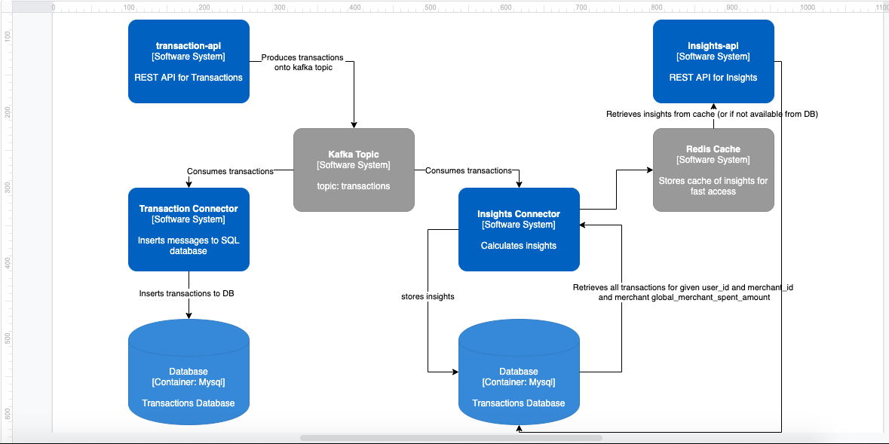

# Background

Emma runs a single SQL database with the following tables:

```
Users (id, first_name, last_name)

Merchants (id, display_name, icon_url, funny_gif_url)

Transactions (id, user_id, date, amount, description, merchant_id)
```

Let's assume there is a REST API which accepts transactions:

```
POST /transactions

{
    "userId": "c36da3d0-6f40-4203-a4c7-9b6692f1bc28",
    "merchant_id": "7ff2cf83-1972-437a-b6d5-a9f438a787e0",
    "date": "2011-10-05T14:48:00.000Z",
    "amount": 11.21,
    "description": "Venti Latte"
}
```

The API would be probably called by some machine process (e.g. aggregator), which aggregates transactions from various sources (Plaid, SaltEdge etc.) and sends requests to the API in question. The API then inserts the transactions into SQL database. 

# Proposal

The solution I'm proposing is based on Kafka message streaming. At the end of the execrcise we'll have two Microservices/APIs:
- Transactions API
- Insights API

We'll also end up with two separate databases. The goal is to not interfere with the business domain of the Transactions API. It does one job and does it well - it enables clients to POST and (pressumably) GET transactions from that API. For this demo I'm not going to implement GET method on that API.

The Transactions Database stores transactions only. The Insight database contains two tables described below. 

The Insights API will only serve the insights.

There will be decoupling layer between the Kafka topics and SQL databases (Connectors which consume messages, process and store in DBs). This would ensure that databases are not overloaded with write requests. Kafka would be the crucial element of the system and we would need to take a good care to scale it appropriately.

The high level diagram (Component diagram in C4 terminology) looks like this:



This architecture let's us scale each element separately. Obviously in this early stage of the prototype it's hard to say which parts would be the onses hardest hit - but we should be at least able to scale them up later (assuming good observability!).

Pros: 
- We can scale each component separately
- Existing database is not amended
- We're not establishing a "backdoor" connection to Transactions SQL database (and we should not be if we want a proper microservice architecture).
- We will not need the automated batch jobs to generate reports. The Insights service would be sufficiently performant to serve the insights directly to the users. 

Cons:
- We're sacrificing data consisetncy i.e. the system is eventually consitent.
- The system complexity grows. We're having to manage a few components. 


# Assumptions 
- We do not need fine grained time/date periods. Calculation granularity is set to be a day (e.g. we can compare user insights for a given day, but we can't select a particular time periods within a day). It's probably fair to say that we (or our users) don't want to be comparing themselves to others every hour. Daily is good enough. 
- Insights Database stores daily amounts
- Insights API can be asked for insights between days. API would do the aggregations and summarise the totals and percentiles. 

# De-normalised table schemas

**The table schema for user based insights**


| Field name | Type | Example | Comments |
|------------|------|---------|----------|
| user_id | uuid | fd92fb65-cb63-41a0-a85d-116b83548d29|
| merchant_id | uuid | b62cfe89-4346-4e27-b303-6c5268e77c83|
| date | date | 2021-09-13 | We aggregate insights daily|
| user_merchant_spent_amount | big float | 11421.56 | Sum of all received transactions for a given user |
| percentile_spent | small float | 0.03 | Percentile of all transactions for given user and merchant vs global amount spent at this merchant |


**A schema for merchant totals**

| Field name | Type | Example | Comments |
|------------|------|---------|----------|
| merchant_id | uuid | b62cfe89-4346-4e27-b303-6c5268e77c83 | Name of the merchant|
| global_merchant_spent_amount | big float | 8435345.23|

# Insights Connector algorithm

- A new transaction is picked up by the Insights Connector

```
{ 
    user_id: xyz,
    merchant_id: abc,
    amount: 10.99,
    date: '2021-09-14'
}
```
- Connector grabs all the transactions for a given user_id and merchant_id. Additionally it grabs the global_merchant_spent_amount
- It uses the formula to calculate the percentile : 
 sum(all transactions for a user_id and merchant_id) / global_merchant_spent_amount
- It stores the percentile in the DB